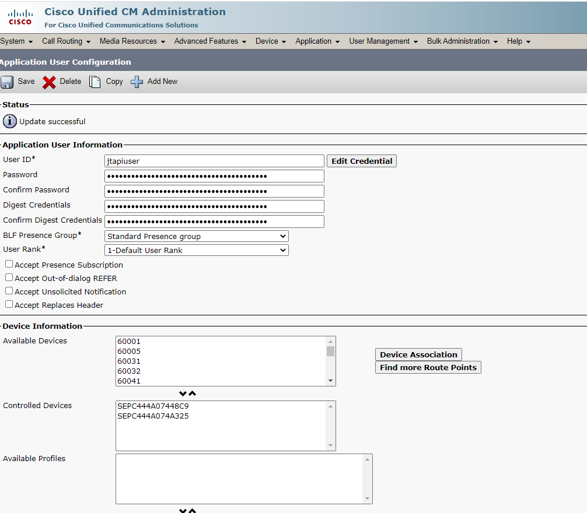

## What is this?
This example program displays the caller information registered in the phonebook.
        - Display image/text caller information depending on phone model.
        - Auto-hide caller information when a call is dropped.
        - Answer a call.
        - Support 

## Development environment.
	CUCM 11.5
	Cisco JTAPI
	Cisco IP Phone Services Software Development Kit
	Eclipse
	Spring boot
	Spring Tool Suite: (installation: https://www.codejava.net/ides/eclipse/install-spring-tool-suite-for-existing-eclipse-ide)
	Lombok: (installation: https://projectlombok.org/setup/eclipse)

## Update project.
    Right Click on CallerPopup project,  Maven > Update Project.

## Build project.
    Right Click on CallerPopup project,  Run As > Maven test

## Run project on eclipse.
    Right Click on CallerPopup project,  Run As > Spring Boot App
    
## Setting
you change the setting to use it.

#### CUCM Configuration

	
#### configuration
	path : /source/src/main/resource/application.properties

	server.port=<APP Lisen Port>
	ipps.cucm.providerString=<CUCM IP1>,<CUCM IP2>;login=<CUCM APP ID>;passwd=<CUCM APP PWD>;appinfo=callerPopup
	ipps.server.url=http://<ServerIP>:<ServerPort>
	ipps.path.popup = /popup
	ipps.path.images = /images
	ipps.path.answer = /answer
	logging.level.com.comtec.ipps = DEBUG
	
## Example
#### run screenshot

#### Code Example
You correct file to com.comtec.ipps.cp.data.ExamplePhoneBookRepository
	public class ExamplePhoneBookRepository implements PhoneBookRepository {
		...
        	}
		Map<String, UserImpl> users = new HashMap<>();

		public ExamplePhoneBookRepository() {
		    // Here you write.
		    users.put("1005", new UserImpl("1005", "Sin Jageum", "SHC1005.png"));
		}

		@Override
		public PhoneUser findUserByPhoneNumber(String phoneNumber) {
		    return users.get(phoneNumber);
		}
	}

## License
This project is licensed under the Apache License 2.0 - see the  [LICENSE.md](./LICENSE.md) file for details.
